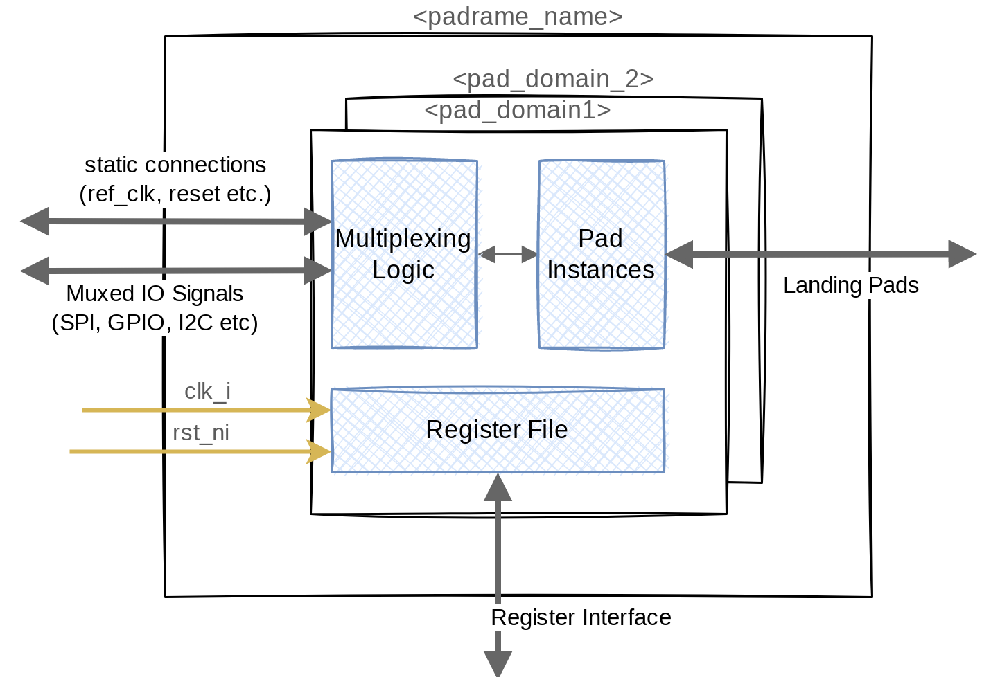

.. _chapter_hw_overview_and_integration:

============================================
Generated Hardware Overview and Integration
============================================

Architectural Overview
----------------------

   RTL Architectural Overview of Padrick generated pad multiplexing IPs.

The padrick `generate rtl` command generates a complete RTL subproject including
``Bender.yml`` files for the Bender dependency management tool. The topleevel
module ``<padframe.name>.sv`` wraps pad domain module instances, one for each
pad domain defined in your config file. This structure simplifies power-intent
specification in case you have multiple IO voltage/power domains. Each power
domain contains a configuration register file which controls the IO Multiplexing
logic and the default pad control signals. The multiplexing logic is wrapped in
yet another, purely combinational submodule which contains multiplexers for the
various peripheral port->pad signals and priority decoders + multiplexers for the
pad->peripheral port direction. That is, writing to a pads multiplexer select signal
config register will configure both directions of the pad <-> peripheral port
connectivity.

.. hint:: In case multiple pads are configured to connect to the same peripheral
          port, e.g. ``pad_01`` and ``pad_02`` both connect to port ``i2c.sda``,
          the tx driver of both pads will be connected to the I2C peripheral's
          SDA_out signal but only ``pad_01``'s RX buffer (GPIO with smaller
          index after alphabetic ordering) will connect to the I2C periphral's
          SDA_in signal. After all, we cannot connect two IO pads to the same
          input signal. This would cause a drive conflict.

At the same hierarchical level as the multiplexing logic module, there is a pad
instantiation module that uses the pad template defined in the configuration
file to instantiate the desired IO pads from the your IO library. It connects to
the multiplexing logic module and is controlled by the configuration register
file and the static connection signals exposed at the toplevel.

The toplevel module exposes the various signals of your padframe in
the form of SystemVerilog structs. These are defined in the
``pkg_<padframe.name>.sv``. In general, the generated toplevel padframe IP will
expose the following signals:

``clk_i``
  The clock used for the configuration interface and the configuration registers (the multiplexing logic is purely combinational and thus unclocked).

``rst_ni``
  An active-low asynchronous reset signal used for resetting the generated internal configuration register.

``port_signals_soc2pad``
  A hierarchical struct of all ``peripheral signals`` with direction peripheral to IO pad organized by ``port_group``.

``port_signals_pad2soc``
  A hierarchical struct of all ``peripheral signals`` with direction IO pad to peripheral organized by ``port_group``.

Landing Pads
  A expanded list of bidirectional landing pad signals (i.e. the signals
  connecting to your IO landing pads or IO Bumps). Every pad signal of kind
  ``pad`` for every ``pad_instance`` is exposed in this list.

``config_req_i``
  The request side of a `register_interface bus
  <https://github.com/pulp-platform/register_interface>`_ used to communicate with the internal configuration register files.

``config_req_i``
  The response side of a `register_interface bus
  <https://github.com/pulp-platform/register_interface>`_ used to communicate with the internal configuration register files.

Generated Configuration Register File
-------------------------------------

As part of the RTL generator, padrick will auto-generate a configuration
register file that is used to control the pad multiplexing the various IO pad
control signals. Each register is 32-bit wide and exposed through a
`register_interface bus <https://github.com/pulp-platform/register_interface>`_.

The tool internally leverages Opentitan's register tool
(`<https://docs.opentitan.org/doc/rm/register_tool/>`_) to generate those
register file using an hjson configuration file. This intermediate hjson file
generated by padrick is also available as part of the generated files of the RTL
generator and provides the definitive and compact reference of all generated
registers.

In general, two registers (or more if 32-bits are not enough) are generated for each `pad_instance`:

``<pad_instance_name>_CFG(0,1,2...)``
  This register controls the default values for each dynamic pad configuration
  signal that is not currently under the control of a connected peripheral. Each
  dynamic pad signal is assigned a dedicated field within this register with
  reset value controlled by the pad_instance's connection block. Here is an
  excerpt of a padrick generated register hsjon file:

.. code-block:: hjson

  {
          name: IOPAD_1_CFG
          desc: '''
            Pad signal configuration.
          '''
          swaccess: "rw"
          fields: [
            {
                bits: "0"
                name: chip2pad
                desc: '''
                     
                '''
                swaccess: "rw"
                hwaccess: "hro"
                resval: "0"
            },
            {
                bits: "1"
                name: tx_en
                desc: '''
                     Active high TX driver enable 
                '''
                swaccess: "rw"
                hwaccess: "hro"
                resval: "0"
            },
            ...
          ]
      }

``<pad_instance_name>_MUX_SEL``
  This register controls the multiplexing in front of the pad instance. Each
  *connectable* peripheral port is assigned an *enum value*. Here is an excerpt
  of a padrick generated register hjson file:

.. code-block:: hjson

  {
          name: IOPAD_1_MUX_SEL
          desc: '''
              Pad signal port multiplex selection for pad iopad_1. The programmed value defines which port
              is connected to the pad.
          '''
          swaccess: "rw"
          hwaccess: "hro"
          resval: 0
          fields: [
              {
                  bits: "2:0"
                  enum: [
                      { value: "0", name: "register", desc: "Connects the Pad to the internal configuration register. This is the default value."}
                      { value: "1", name: "port_SPIM_miso", desc: "Connect port miso from port group SPIM to this pad." }
                      { value: "2", name: "port_SPIM_mosi", desc: "Connect port mosi from port group SPIM to this pad." }
                      { value: "3", name: "port_SPIM_sck", desc: "Connect port sck from port group SPIM to this pad." }
                      { value: "4", name: "port_SPIM_cs", desc: "Connect port cs from port group SPIM to this pad." }
                      { value: "5", name: "port_UART_rx", desc: "Connect port rx from port group UART to this pad." }
                      { value: "6", name: "port_UART_tx", desc: "Connect port tx from port group UART to this pad." }
                  ]
              }
          ]
      }

.. hint:: Padrick calls OpenTitan's register tool internally. So although you
          have access to the padrick-generated hjson file you don't have to call
          reggen manually. Padrick takes care of generating the System Verilog
          RTL for the register file from the hjson internally.

Customization of Generated RTL/ Generating Custom Output Files
--------------------------------------------------------------

Padrick internally uses so called Mako templates
(`<https://docs.makotemplates.org/en/latest/syntax.html>`_) for RTL, driver etc.
generation. The default template files embedded in Padrick's sourcecode should
be fitting most needs. However, sometimes particular tape-out requirements
require customization of the auto-generated RTL. A naive approach would be to
just plainly modify the generated files. This approach is neither technology
portable nor efficient since it requires the user to reapply the same
modifications whenever the padframe structure (configuration YAML) changes and
thus the RTL files need to be re-generated. Instead, Padrick provides you with
the possibility to customize the Mako templates themselves to directly generate
customized RTL.

Customizing Padrick Output with a Generator Settings File
...........................................................
Padrick's `generate` subcommands accept an optional flag (`-s <filename>`) to specify a ``generator_settings.yml`` file.
This is a YAML file which allows you to control padrick's template rendering behavior. Here is an example customization file:

.. code-block:: yaml

  manifest_version: 2
  rtl_templates:
    toplevel_sv_package:
      name: SV package
      target_file_name: pkg_{padframe.name}.sv
      template: rtl_templates/pkg_padframe.sv.mako
      skip_generation: false
    pad_domain_top:
      name: Paddomain module {pad_domain.name}
      target_file_name: '{padframe.name}_{pad_domain.name}.sv'
      template: rtl_templates/pad_domain.sv.mako
      skip_generation: false
    pad_inst_module:
      name: Pad instantiation module {pad_domain.name}
      target_file_name: '{padframe.name}_{pad_domain.name}_pads.sv'
      template: rtl_templates/pads.sv.mako
      skip_generation: false
  driver_templates:
    ...

For each generator, there are various template customization entries. The key of
the entry defines which output file is supposed to be customized. There are 4
different key value pairs you can specify for each entry:

``name``
  The ``name`` field is used for documentation and logging purposes only. It has
  no effect on the actual template rendering.

``target_file_name``
  This is a Mako template that renders to the filename of the generated file.
  E.g. in the example above, the RTL generator will render the
  ``toplevel_sv_package`` template using the filename: ``pkg_<the name of your
  padrame>.sv``.

``template``
  The path to a mako template file used for rendering the output file. Here you
  can specify the path to your customized Mako template.

``skip_generation``
  If set to ``true``, the output file for this template is not generated.
  Usefull, if you want to e.g. avoid generating the legacy IPApprox
  ``src_files.yml`` file.

.. important:: You *don't* have to write your modified template and the
               `generator_settings.yml`file from scratch. Padrick can generate a
               folder structure for you that already contains a
               `padrick_generator_settings.yml` file and a copy of each of the
               built-in templates. This makes customization much easier. Use the
               `padrick generate template-customization` command to create it.

Generating Custom Output Files
..............................

The generator settings file allows you to customize the output of existing
padrick generators. However, you cannot add entirely new output formats. If you
need to generate an additional file which padrick does not already have a
dedicated generator for, you can use the generic template render command
`padrick generate custom`. This command, in addition to you padframe_config.yml
file accepts an additional mako template file argument.

.. hint:: With this command you can render your own custom templates and thus
          generate new output file formats without modifying padrick's source
          code. Still, if you wrote a template that might be of general interest
          (not a tape-out specifig output format) consider contributing it
          through a PR.

Writing Custom templates
........................

As mentioned before, padrick uses the template rendering engine *mako* to create
its output files. The advantage of mako over similar template rendering engines
is, that it directly evaluates inline python expressions and thus allows very
natural interaction between the template and a python data model.

Providing a tutorial on mako is outside the scope of this documentation. Please
refer to `<https://docs.makotemplates.org/en/latest/syntax.html>`_ for more
information. However, an important aspect of every template rendering flow is
the variables available in the template rendering context, i.e. how do you
access the padframe config data when generating the template. Padrick uses an
advanced data modeling library called `pydantic
<https://pydantic-docs.helpmanual.io>`_ to validate your padframe configuration
file and map it to a python class hierarchy. The mapped padframe configuration
object (and instance of :py:class:`padrick.Model.Padframe`) is directly exposed
to your template's rendering context under the variable name ``padframe``. Have a
look at the built-in templates (use ``padrick generate template-customization``
to create a modifiable copy of them) on how to use this data model or inspect
the python class documentation directly.

.. hint:: If you customize templates which are generated at the ``pad_domain``
          level (i.e. one file is generated per pad_domain) the template, in
          addition to the ``padframe`` variable is handed a
          :py:class:`~padrick.Model.PadDomain` instance under the variable name
          ``pad_domain``.

HW Integration
--------------

Integration of the generated Padframe RTL is straigth forward:

1. In your toplevel module (or wherever you plan to instantiate the padframe),
   declare helper connection signals of struct type:

   - ``pkg_<padframe.name>::port_signals_pad2soc_t``,
   - ``pkg_<padframe.name>::port_signals_soc2pad_t``,
   - ``pkg_<padframe.name>::static_connection_signals_pad2soc_t`` and
   - ``pkg_<padframe.name>::static_connection_signals_soc2pad_t``,

2. Connect all your peripheral signals and static conneciton signals to the
   helper struct signals.

3. Instantiate the ``<padframe.name>.sv`` module and connect it's port to your helper signals.

4. Connect your configuration bus to the the padframes configuration port. In
   case you are using a different protocol than ``register_interface``, use one
   of the available protocol converters in
   `<https://github.com/pulp-platform/register_interface>`_.
